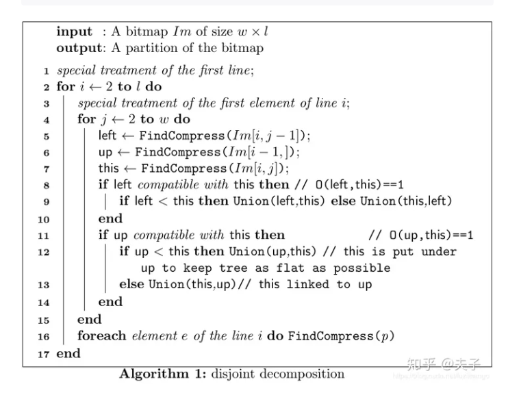

<!-- 前端、后端、C++算法三部分开发者各自编写此文档,文档中实现流程尽可能详细  -->

# 基于Vue3的网页设计与部署


## 简介
MegaEarth 网页端是基于 Vue3 构建的地图发布与管理平台。该项目旨在实现对本地部署的 MegaPublish 软件进行网页推流，通过这个网页端应用，用户可以在浏览器中访问本地的 MegaPublish 软件并调用一些软件中的包括获取信息、地图测量、图层管理、瓦片管理等操作。

## 功能
1. 点击经纬度、视图范围；

2. 面积测量、三角测量；

3. 图层显示隐藏、图层删除；

## 技术栈
1. Vue3（   `"vue": "^3.3.4"`，`"vuex": "^4.0.2"`)

2. Element-plus（`"element-plus": "^2.4.2"`)

## 实现流程
**1.项目源文件结构**

```csharp
src
├─ App.vue //主应用组件，整个应用的根组件
├─ assets //存放静态资源文件，页面图标css等
│    └─ me.min.js //MegaEarth二次开发UMD模块文件
├─ components
│    ├─ Cim.vue //选项式MegaEarth实现（暂不维护）
│    ├─ Mega.vue //组合式MegaEarth实现，包含一些功能的实现
│    └─ TopNavigation.vue //页面顶部菜单栏
├─ main.js //应用的入口文件，含初始化应用的代码，例如引入 Vue、Vuex 、ElementPlus等
├─ router //路由配置文件
│    └─ index.js
├─ store //存放应用的状态管理（Vuex）相关文件
│    └─ index.js
└─ style //存放样式文件
       ├─ MegaCSS.css
       └─ TopNavigationCSS.css
```

**2.顶部菜单**

是用户与应用进行交互的主要入口。

- 导入必要的库和组件：vue,elment-plus,me.min.js
- 调用elmentplus组件库引入`el-menu`,`el-notification`,`el-dialog`,`    el-drawer`组建基本页面框架；

- 通过**响应式变量**控制菜单项的激活状态，调出相应的菜单对应页面；
- 通过**Vuex状态管理** 获取和更新用户配置信息；
- 用户中心通过弹窗实现，图层管理通过抽屉实现，点击事件通过监听鼠标点击事件实现，由Mega.vue通过 Vuex  更新并显示鼠标点击位置的经纬度和高度信息;
- 在组件挂载时注册鼠标移动事件，实现悬浮信息框跟随鼠标移动,在组件销毁前注销鼠标移动事件的监听;


**3.MegaEarth功能实现-Mega.vue**

- **定义响应式数据**：在 `setup` 函数中，定义了许多响应式的数据，包括 `isSelected` 和 `layerData`。这些数据主要用于存储用户的交互状态和图层的信息。同时，也可能使用 Vuex 来管理全局的状态，这些状态可以被多个组件共享和修改。
- **监听客户端**：在组件创建后，使用 `onMounted` 钩子函数来监听客户端的状态。如果系统连接成功，就开启后续所需要的功能状态，如点击、测量、移动等。
- **监听鼠标信息以及视图信息**：使用 `watch` 或者 `watchEffect` 函数来监听鼠标的位置和视图的变化。当鼠标移动或者视图变化时，更新相应的响应式数据。
- **创建页面内部控件**：在模板中，使用 `v-for` 指令和 `v-if` 指令来创建和控制页面内部的控件。这些控件可能包括按钮、输入框、列表等，用于接收用户的输入和显示数据。
- **处理用户交互**：使用 `@click`，`@input`，`@change` 等事件监听器来处理用户的交互。当用户点击按钮、输入文本、选择选项等操作时，调用相应的函数来处理这些事件，并更新响应式数据。
- **进行图层管理**：使用 `addLayerToLayerControl` 函数来添加图层到图层控制器。当用户选择添加新的图层时，调用这个函数来创建新的图层，并更新 `layerData` 数组。同时，也可能提供删除图层、隐藏图层、显示图层等功能，用于管理图层的状态。

## .terrain读取流程伪代码
 >[伪代码编写参考链接](https://zhuanlan.zhihu.com/p/105582648) https://zhuanlan.zhihu.com/p/105582648




## 实现难点
（1）探求稳定的连接方式与组件挂载方式及值传递展示


## 部署方式
克隆本项目至本地，进入项目根目录`vue-test`

1. 安装项目依赖:

   ```bash
   npm install
   ```

   2.启动开发服务器：

   ```bash
   npm run dev
   ```

   3.启动上面所提供的 `http://localhost:端口号`进行页面访问 

   - 请确保 Node.js 版本为 20 或以上。
   - 推荐使用支持 Vue3 的现代浏览器以获取最佳体验。

## 使用方式
确保能正常运行本地的MegaPublish客户端，查看项目设置中的url与端口号；

运行上面的vue3网页端，输入正确url与端口号，即可实现本地与web推流。

## 更新日志
2024.1.8 新增技术文档
