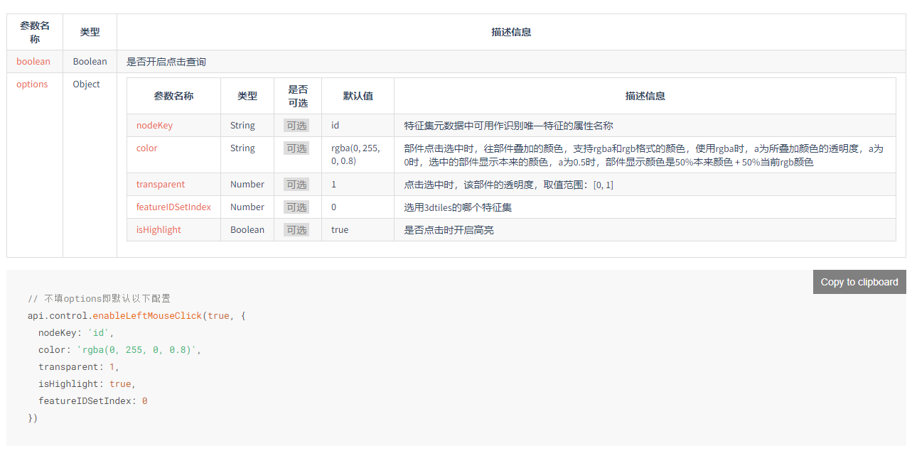

<!-- 前端、后端、C++算法三部分开发者各自编写此文档,文档中实现流程尽可能详细  -->

# 基于 Vue3 的网页设计与部署

## 简介

MegaEarth 网页端是基于 Vue3 构建的地图发布与管理平台。该项目旨在实现对本地部署的 MegaPublish 软件进行网页推流，通过这个网页端应用，用户可以在浏览器中访问本地的 MegaPublish 软件并调用一些软件中的包括获取信息、地图测量、图层管理、瓦片管理等操作。

## 功能

1. 点击经纬度、视图范围；

2. 面积测量、三角测量；

3. 图层显示隐藏、图层删除；

4. 添加三维组件（POI点、路径、区域）；

5. 添加已在构力bim平台上传并进行了流式转换的建筑模型（以3dtiles格式），并可以实现通过模型构件id进行查询对应构件属性和删除构件

## 技术栈

1. Vue3（ `"vue": "^3.3.4"`，`"vuex": "^4.0.2"`，`"pinia": "^2.1.7"`)

2. Element-plus（`"element-plus": "^2.4.2"`)

## 实现流程

### 1.项目源文件结构

```javascript
src
│  App.vue //主应用组件，整个应用的根组件
│  main.js //应用的入口文件，含初始化应用的代码，例如引入 Vue、Vuex 、ElementPlus等
│
├─assets //存放静态资源文件，页面图标css等
│      me.min.js //存放静态资源文件，页面图标css等
│
├─components
│  │  BimControl.vue //BIM模型查询和修改构件属性、删除构件的按钮和相关窗口实现
│  │  Cim.vue //选项式MegaEarth实现（暂不维护）
│  │  LayerManager.vue //组合式MegaEarth实现，包含一些功能的实现
│  │  Mega.vue //组合式MegaEarth实现，包含一些功能的实现
│  │  PageControls.vue //页面内控件（面积、测量、画框）
│  │  TileCaculate.vue //.terrain解求
│  │  TopDiv.vue
│  │  TopNavigation.vue //页面顶部菜单栏
│  │  User.vue
│  │
│  └─addLayers //实现添加图层（三维组件、3dtiles数据集）
│          GeometryDecal.vue
│          Label.vue
│          Marker.vue
│          ODline.vue
│          Polyline.vue
│          TextureDecal.vue
│          Tileset.vue
│          Wall.vue
│          WaveDecal.vue
│
├─router //路由配置文件
│      index.js
│
├─store //存放应用的状态管理相关文件
│      bim.js
│      index.js
│
└─style //存放样式文件
        MegaCSS.css
        TopNavigationCSS.css
```

### 2.顶部菜单

是用户与应用进行交互的主要入口。

- 导入必要的库和组件：vue,elment-plus,me.min.js
- 调用 elmentplus 组件库引入`el-menu`,`el-notification`,`el-dialog`,`    el-drawer`组建基本页面框架；

- 通过**响应式变量**控制菜单项的激活状态，调出相应的菜单对应页面；
- 通过**Vuex和pinia 状态管理** 获取和更新用户配置信息；
- 用户中心通过弹窗实现，图层管理通过抽屉实现，点击事件通过监听鼠标点击事件实现，由 Mega.vue 通过 Vuex 更新并显示鼠标点击位置的经纬度和高度信息;
- 在组件挂载时注册鼠标移动事件，实现悬浮信息框跟随鼠标移动,在组件销毁前注销鼠标移动事件的监听;

### 3.MegaEarth 功能实现-Mega.vue

- **定义响应式数据**：在 `setup` 函数中，定义了许多响应式的数据，包括 `isSelected` 和 `layerData`。这些数据主要用于存储用户的交互状态和图层的信息。同时，也可能使用 Vuex 来管理全局的状态，这些状态可以被多个组件共享和修改。
- **监听客户端**：在组件创建后，使用 `onMounted` 钩子函数来监听客户端的状态。如果系统连接成功，就开启后续所需要的功能状态，如点击、测量、移动等。
- **监听鼠标信息以及视图信息**：使用 `watch` 或者 `watchEffect` 函数来监听鼠标的位置和视图的变化。当鼠标移动或者视图变化时，更新相应的响应式数据。
- **创建页面内部控件**：在模板中，使用 `v-for` 指令和 `v-if` 指令来创建和控制页面内部的控件。这些控件可能包括按钮、输入框、列表等，用于接收用户的输入和显示数据。
- **处理用户交互**：使用 `@click`，`@input`，`@change` 等事件监听器来处理用户的交互。当用户点击按钮、输入文本、选择选项等操作时，调用相应的函数来处理这些事件，并更新响应式数据。
- **进行图层管理**：使用 `addLayerToLayerControl` 函数来添加图层到图层控制器。当用户选择添加新的图层时，调用这个函数来创建新的图层，并更新 `layerData` 数组。同时，也可能提供删除图层、隐藏图层、显示图层等功能，用于管理图层的状态。

### 4.添加图层功能实现
对不同类型的图层设置了各自的响应式数据去接收用户设置的参数，有数字、geojson、文本、url、图片的base64编码等各种格式，再将这些数据组织成cim平台api规定的json格式作为对应api的参数实现图层的添加。
其中添加3dtiles数据时还要输入用户使用构力控制台应用的clientId、clientsecret和带Bearer头的AccessToken（这个token在请求的headers中添加），这三个数据和模型的url使用了pinia的状态管理，以便bimcontrol.vue去实现一些bim模型相关请求的发送。

### 5.BIM模型的删改查
单击顶部导航栏"BIM模型操作“后，四个按钮在页面下方出现。目前要通过“查询构件属性”来选中构件：可以通过dbId或者componentId(也是OBVID)两种id进行查询，查询成功后对应构件已选中，单击“显示构件属性”即可显示构件属性窗口，单击“删除构件”即可删除对应构件。

#### 存在的问题
- “构件搜索”的接口目前只支持通过dbId进行搜索，“获取指定构件”接口是通过componentId进行获取，所以构件的搜索目前只能通过这两个属性实现；
- cim平台api存在问题，无法通过单击获取构件id等数据，进而无法实现单击高亮、选中构件并进行对应构件查询


- 修改构件属性的接口在文档上的教学不清楚，无法实现


**上述问题均已向构力反映**


## .terrain 读取流程伪代码

> [伪代码编写参考链接](https://zhuanlan.zhihu.com/p/105582648) https://zhuanlan.zhihu.com/p/105582648


## 实现难点

（1）探求稳定的连接方式与组件挂载方式及值传递展示
（2）

## 部署方式

克隆本项目至本地，进入项目根目录`vue-test`

1. 安装项目依赖:

   ```bash
   npm install
   ```

   2.启动开发服务器：

   ```bash
   npm run dev
   ```

   3.启动上面所提供的 `http://localhost:端口号`进行页面访问

   - 请确保 Node.js 版本为 20 或以上。
   - 推荐使用支持 Vue3 的现代浏览器以获取最佳体验。

## 使用方式

确保能正常运行本地的 MegaPublish 客户端，查看项目设置中的 url 与端口号；

运行上面的 vue3 网页端，输入正确 url 与端口号，即可实现本地与 web 推流。

## 更新日志

2024.1.8 新增技术文档

2024.1.15 新增画框与 terrain

2024.1.17 将页面控件封装为组件

2024.1.20 将图层管理封装为组件，并完善图层显示、隐藏、删除等操作，后续会加入增图层

2024.1.25 完成对框选区域的terrain瓦片解析，并将区域内的顶点筛选出来

2024.1.29 完成添加三维组件；摄像机飞行；bim模型3dtiles加载，查询构件并显示构件属性，删除构件（修改构件属性、鼠标点击构件查询待完成）