<!-- 前端、后端、C++算法三部分开发者各自编写此文档,文档中实现流程尽可能详细  -->

# 基于 Vue3 的网页设计与部署

## 简介

MegaEarth 网页端是基于 Vue3 构建的地图发布与管理平台。该项目旨在实现对本地部署的 MegaPublish 软件进行网页推流，通过这个网页端应用，用户可以在浏览器中访问本地的 MegaPublish 软件并调用一些软件中的包括获取信息、地图测量、图层管理、瓦片管理等操作。

## 功能

1. 点击经纬度、视图范围；
2. 面积测量、三角测量；
3. 图层显示隐藏、图层删除；
4. 添加三维组件（POI点、路径、区域）；
5. 添加已在构力bim平台上传并进行了流式转换的建筑模型（以3dtiles格式），并可以实现通过模型构件id进行查询对应构件属性和删除构件
6. 框选Bbox最大外接矩形的terrain顶点坐标信息；
7. 将Bbox最大外接矩形传递到后端解求tif顶点信息；

## 技术栈

1. Vue3（ `"vue": "^3.3.4"`，`"vuex": "^4.0.2"`，`"pinia": "^2.1.7"`)

2. Element-plus（`"element-plus": "^2.4.2"`)

3. Proj4（坐标转换）

4. quantized-mesh-decoder（解析terrain）

## 实现流程

### 1.项目源文件结构

```javascript
src
│  App.vue //主应用组件，整个应用的根组件
│  main.js //应用的入口文件，含初始化应用的代码，例如引入 Vue、Vuex 、ElementPlus等
│
├─assets //存放静态资源文件，页面图标css等
│      me.min.js //存放静态资源文件，页面图标css等
│
├─components
│  │  BimControl.vue //BIM模型查询和修改构件属性、删除构件的按钮和相关窗口实现
│  │  Cim.vue //选项式MegaEarth实现（暂不维护）
│  │  LayerManager.vue //组合式MegaEarth实现，包含一些功能的实现
│  │  Mega.vue //组合式MegaEarth实现，包含一些功能的实现
│  │  PageControls.vue //页面内控件（面积、测量、画框）
│  │  TileCaculate.vue //.terrain解求
│  │  TopDiv.vue
│  │  TopNavigation.vue //页面顶部菜单栏
│  │  User.vue
│  │
│  └─addLayers //实现添加图层（三维组件、3dtiles数据集）
│          GeometryDecal.vue
│          Label.vue
│          Marker.vue
│          ODline.vue
│          Polyline.vue
│          TextureDecal.vue
│          Tileset.vue
│          Wall.vue
│          WaveDecal.vue
│
├─router //路由配置文件
│      index.js
│
├─store //存放应用的状态管理相关文件
│      bim.js
│      index.js
│
└─style //存放样式文件
        MegaCSS.css
        TopNavigationCSS.css
```

### 2.顶部菜单

是用户与应用进行交互的主要入口。

- 导入必要的库和组件：vue,elment-plus,me.min.js
- 调用 elmentplus 组件库引入`el-menu`,`el-notification`,`el-dialog`,`    el-drawer`组建基本页面框架；

- 通过**响应式变量**控制菜单项的激活状态，调出相应的菜单对应页面；
- 通过**Vuex和pinia 状态管理** 获取和更新用户配置信息；
- 用户中心通过弹窗实现，图层管理通过抽屉实现，点击事件通过监听鼠标点击事件实现，由 Mega.vue 通过 Vuex 更新并显示鼠标点击位置的经纬度和高度信息;
- 在组件挂载时注册鼠标移动事件，实现悬浮信息框跟随鼠标移动,在组件销毁前注销鼠标移动事件的监听;

### 3.MegaEarth 功能实现-Mega.vue

- **定义响应式数据**：在 `setup` 函数中，定义了许多响应式的数据，包括 `isSelected` 和 `layerData`。这些数据主要用于存储用户的交互状态和图层的信息。同时，也可能使用 Vuex 来管理全局的状态，这些状态可以被多个组件共享和修改。
- **监听客户端**：在组件创建后，使用 `onMounted` 钩子函数来监听客户端的状态。如果系统连接成功，就开启后续所需要的功能状态，如点击、测量、移动等。
- **监听鼠标信息以及视图信息**：使用 `watch` 或者 `watchEffect` 函数来监听鼠标的位置和视图的变化。当鼠标移动或者视图变化时，更新相应的响应式数据。
- **创建页面内部控件**：在模板中，使用 `v-for` 指令和 `v-if` 指令来创建和控制页面内部的控件。这些控件可能包括按钮、输入框、列表等，用于接收用户的输入和显示数据。
- **处理用户交互**：使用 `@click`，`@input`，`@change` 等事件监听器来处理用户的交互。当用户点击按钮、输入文本、选择选项等操作时，调用相应的函数来处理这些事件，并更新响应式数据。
- **进行图层管理**：使用 `addLayerToLayerControl` 函数来添加图层到图层控制器。当用户选择添加新的图层时，调用这个函数来创建新的图层，并更新 `layerData` 数组。同时，也可能提供删除图层、隐藏图层、显示图层等功能，用于管理图层的状态。

### 4.添加图层功能实现
对不同类型的图层设置了各自的响应式数据去接收用户设置的参数，有数字、geojson、文本、url、图片的base64编码等各种格式，再将这些数据组织成cim平台api规定的json格式作为对应api的参数实现图层的添加。
其中添加3dtileset数据时还要输入用户使用构力控制台应用的clientId、clientsecret和带Bearer头的AccessToken（这个token在请求的headers中添加），这三个数据和模型的url使用了pinia的状态管理，以便bimcontrol.vue去实现一些bim模型相关请求的发送。
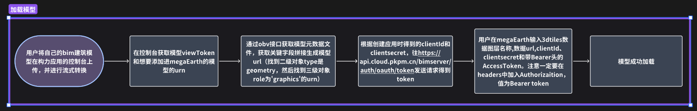

### 5.BIM 模型的删改查

单击顶部导航栏"BIM 模型操作“后，六个按钮在页面下方出现：获取 subDataId、显示构件属性、查询构件属性、修改构件属性、删除构件属性、删除构件。目前要通过“查询构件属性”来选中构件：可以通过 dbId 或者 componentId(也是 OBVID)两种 id 进行查询，查询成功后对应构件已选中，单击“显示构件属性”即可显示构件属性窗口，单击“删除构件”即可删除对应构件。

#### 1） 获取 subDataId

首先截取用户输入的模型 url 中的一段加上"urn:bimbox.object:translation_result_v2/" 作为 externalId，再发送 GET 请求通过`查询数据子集`接口得到 subDataId。注意在进行其他 bim 模型操作前必须先获取 subDataId，后面功能发送的请求的请求体都需要用到 subDataId。
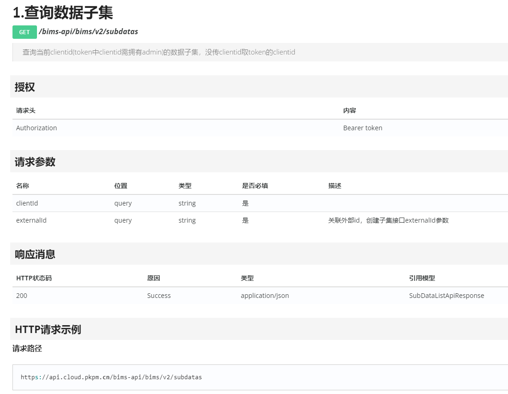

#### 2) 查询构件属性

用户输入属性名及对应属性值即可查询，要注意是严格匹配的：即属性值的大小写要一致，属性名的每一个数字、符号也要一致。单击“搜索”按钮后，如有符合条件的构件，按键下方会出现以对应构件的 batch：id 为文本的按钮，单击即可选中展示在构件属性信息窗口。此功能通过发送 POST 请求到`构件搜索`接口实现。
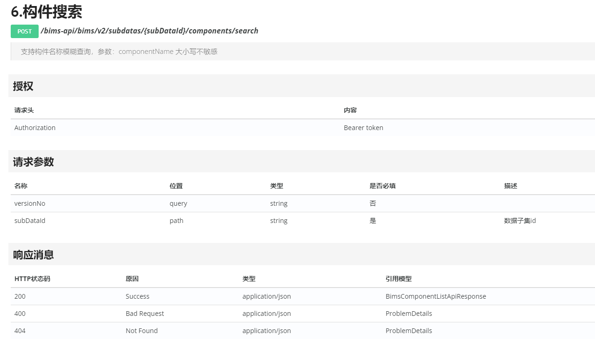

#### 3) 修改/创建构件属性

在键文本框上输入属性名（注意属性名要求和查询时一致），值文本框上输入属性值，单击“确定”按钮即可修改构件属性。当用户想修改、创建多个属性时，单击“+”按钮添加一对键值对文本框；当用户想删除一对键值对文本框，可以单击值文本框后的垃圾桶样式按钮。注意：文本框不能为空。此功能通过发送 POST 请求到`创建或修改构件`接口实现。
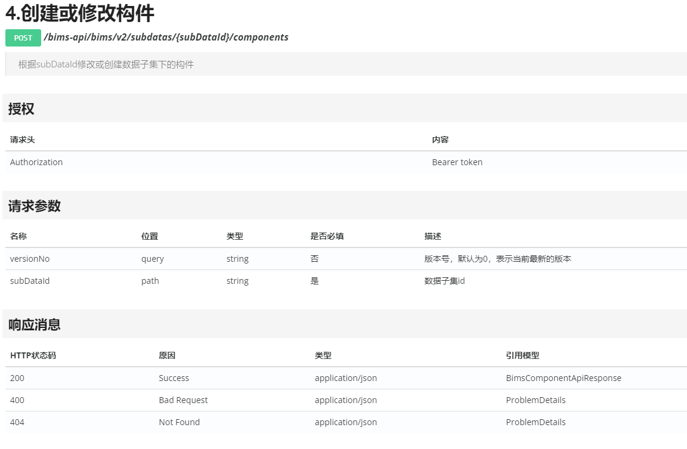

#### 4) 删除构件属性

这个的使用方法与修改/创建构建属性一致，但是删除构件属性只需在文本框中输入想要删除的属性的名字即可。此功能通过发送 POST 请求到`创建或修改构件`接口实现（与第三个功能一致）。

#### 5） 删除构件

在直接单击构件选中后（未实现）或查询构件属性窗口选中构件后，此时 componentId 已被保存，单击“删除构件”按钮后即可直接删除构件。此功能通过发送 DELETE 请求到`删除构件`接口实现。
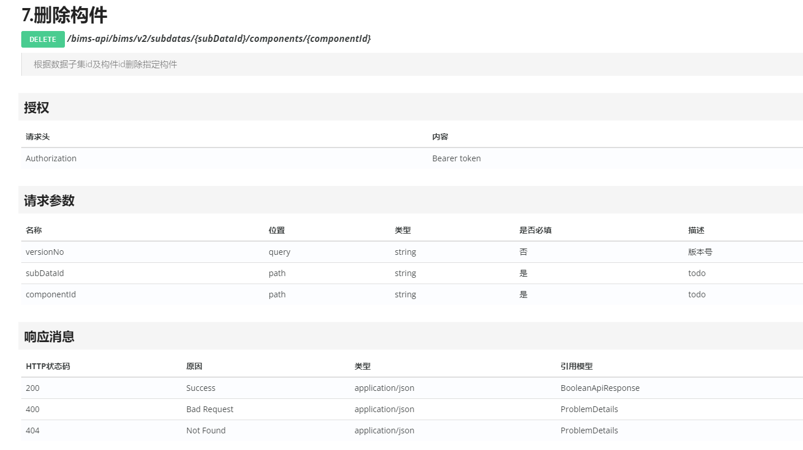

#### 6） 显示构件属性
`构件搜索`接口的响应体中的result属性是一个对象数组，result中的每个对象里的props属性是每个构件的属性。`selectedItemProps`变量负责接收选中的构件的props对象，然后用`groupedProps`计算属性对`selectedItemProps`进行处理。
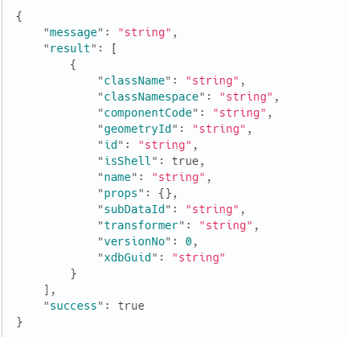

- `groupedProps` 是一个计算属性，它的值是一个对象，这个对象的属性是分组后的 `selectedItemProps.value` 对象的属性。`selectedItemProps.value` 对象的每个属性名都是由组名和属性名组成的，中间用冒号 : 分隔。例如，属性名 `Default:NAME` 的组名是 `Default`，属性名是 `NAME`
- 使用`Object.entries(selectedItemProps.value)` 返回一个数组，数组的每个元素都是一个数组，包含一个属性名和一个属性值。`reduce` 方法将这个数组转换为一个对象，这个对象的属性是分组后的属性。将 `selectedItemProps.value` 对象的属性按照组名进行分组，并返回一个包含分组后的属性的对象
- 在窗口展示界面的代码中，使用`v-for`指令遍历`groupedProps`对象的每个属性，对于
每个属性，创建一个 `div` 元素，以使每个组别间有明显分界。这个 `div` 元素包含一个 `h3` 元素和一个 `table` 元素。`h3` 元素显示组别名，`table` 元素用来装载各个组别中不同属性名及其属性值，以便整体对齐，较为美观。

#### `存在的问题`

- cim 平台 api 存在问题，无法通过直接单击构件获取构件 id 等数据，进而无法实现单击高亮、选中构件并进行对应构件查询
  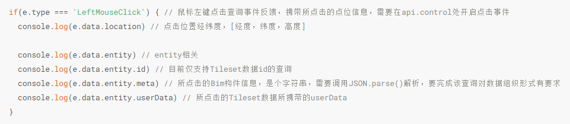
  

如图，api 返回的结果中 tileset 数据的 id 和 userData 为空，meta 为 undefined
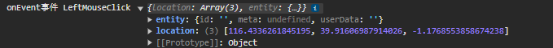

**上述问题均已向构力反映**


### 6.获取Bbox区域的terrain顶点坐标信息【Terrain】

#### 1）技术路线

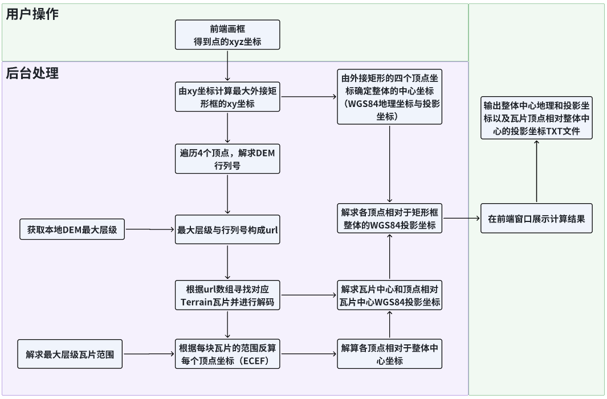

#### **2）实现点击框选范围**

通过调用SDK的[drawHandler]([drawHandler](http://119.91.33.107/sdk/#/reference/drawHandler))的绘制功能实现在Mega Earth地球绘制点串，然后在`api.onEvent`中监听事件，
返回一个包含经纬度以及高度的对象（**其中绘制的点数随机，不一定为4**）

```html
  api.onEvent(e => {
    if(e.type === 'DrawResult') { // 绘制事件反馈，需要在api.drawHandler处开启绘制
        console.log(e.data.lngLatAlts) // 绘制点串，包含经度纬度高度
      }
   })
```

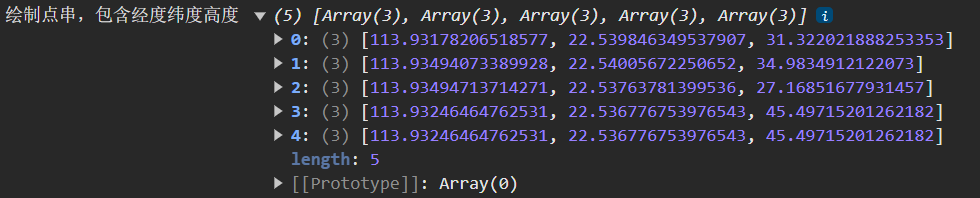

#### 3）获取Bbox最大矩形框

遍历上述点串对象中的每一个坐标点（`只需要其经纬度`），计算最大的外接矩形框，返回数组`[topLeft, topRight, bottomLeft, bottomRight]`，同时将矩形框坐标转化为3857投影坐标，用于后续的瓦片顶点范围筛选。

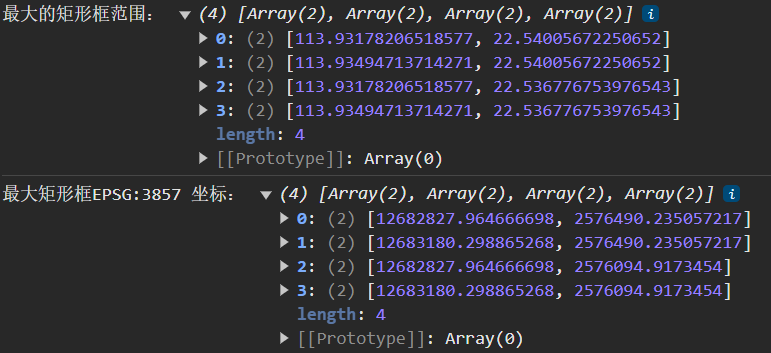

#### 4） 获取瓦片的行列号+构建瓦片url数组

1. 选取多个x方向和y方向的terrain瓦片进行解析，获得每个瓦片中心坐标（原始为ECEF投影坐标，将其转为经纬度坐标），然后计算每个瓦片的x方向和y方向范围。同时已知原点的经纬度为（-90，-180）；

> 在同一层级下，terrain瓦片的x和y方向经纬度范围恒定，但是其ECEF投影坐标下非恒定，通过ECEF中心点坐标获取瓦片范围不够准确。普遍规律为：`列号不变：lat不变，行变大lon变大，centerX增大，centerY减小`,`行号不变：lon不变，列变大lat变大，centerX和centerY都减小`

2. 遍历最大矩形框的经纬度数组，通过已计算的瓦片范围计算每一个点的瓦片行列号，添加它们以及它们的上下左右和4个斜边角瓦片行列号共9个到一个新的集合中，然后将集合中的不重复瓦片行列号转换为数组返回；
3. 计算瓦片行列号的方法是将坐标点的经度（longitude）和纬度（latitude）分别除以**瓦片宽度（xsize）和高度（ysize）**得到瓦片编号的x坐标和y坐标；
4. 将获取得到的行列号数组与最大层级转为url数组，url例如：`http://localhost:3000/DEM/${maxLevel.value}/${item.x}/${item.y}.terrain`,对应本地或远端的terrain文件地址，以供后续解析到正确的瓦片。

#### 5）解析terrain，计算顶点信息

解码函数传入一个URL数组，创建一个 promise 链，用于处理每个 URL，对于每个 URL，函数会执行以下操作：

1. 使用 `axios.get` 发送 GET 请求，获取 URL 的数据。设置 `responseType` 为 `arraybuffer`，表示获取到的数据是 ArrayBuffer 格式。
2. 创建一个 `options` 对象，用于设置解码选项。这里设置 `maxDecodingStep` 为 5，表示最大解码步骤为 5，或者默认为：`DECODING_STEPS.extensions`;
3. 调用 `decode` 函数解码获取到的数据，然后返回解码后的数据。

如果在处理某个 URL 时发生错误，函数会打印错误信息，并返回 `null`。然后，函数使用 `Promise.all` 等待所有 URL 的处理完成，得到一个解码后的数据数组 `decodedDataArray`。

接下来，函数调用 `terrainCenterXYZ` 函数计算每个瓦片的中心点，然后调用 `ecefToWGS84` 函数将这些**中心点**的坐标转换为 WGS84 坐标，最后调用 `wgs84To3857` 函数将这些坐标转换为 EPSG:3857 坐标。

- **瓦片上的各顶点**

已知官方提供的对顶点u、v、height的解码方式为：

| Field      | Meaning                                                      |
| ---------- | ------------------------------------------------------------ |
| **u**      | The horizontal coordinate of the vertex in the tile. When the u value is 0, the vertex is on the Western edge of the tile. When the value is 32767, the vertex is on the Eastern edge of the tile. For other values, the vertex's longitude is a linear interpolation between the longitudes of the Western and Eastern edges of the tile.<br />**切片中顶点的水平坐标。当u值为 0 时，顶点位于瓦片的西边。当值为 32767 时，顶点位于切片的东边。对于其他值，顶点的经度是切片西部边缘和东部边缘经度之间的线性插值。** |
| **v**      | The vertical coordinate of the vertex in the tile. When the v value is 0, the vertex is on the Southern edge of the tile. When the value is 32767, the vertex is on the Northern edge of the tile. For other values, the vertex's latitude is a linear interpolation between the latitudes of the Southern and Nothern edges of the tile.<br />**切片中顶点的垂直坐标。当 v 值为 0 时，顶点位于瓦片的南边。当值为 32767 时，顶点位于切片的北边缘。对于其他值，顶点的纬度是切片的南边和北边纬度之间的线性插值。** |
| **height** | The height of the vertex in the tile. When the height value is 0, the vertex's height is equal to the minimum height within the tile, as specified in the tile's header. When the value is 32767, the vertex's height is equal to the maximum height within the tile. For other values, the vertex's height is a linear interpolation between the minimum and maximum heights.<br/>**切片中顶点的高度。当高度值为 0 时，顶点的高度等于切片内的最小高度，如切片标题中指定。当值为 32767 时，顶点的高度等于切片内的最大高度。对于其他值，顶点的高度是最小高度和最大高度之间的线性插值** |

根据对瓦片Terrain解码后得到的数据如下：

```c++
struct QuantizedMeshHeader
{
    // The center of the tile in Earth-centered Fixed coordinates.图块中心，地心地固坐标系
    double CenterX;
    double CenterY;
    double CenterZ;

    // The minimum and maximum heights in the area covered by this tile.
    // The minimum may be lower and the maximum may be higher than
    // the height of any vertex in this tile in the case that the min/max vertex
    // was removed during mesh simplification, but these are the appropriate
    // values to use for analysis or visualization.
    float MinimumHeight;
    float MaximumHeight;

    // The tile’s bounding sphere.  The X,Y,Z coordinates are again expressed
    // in Earth-centered Fixed coordinates, and the radius is in meters.
    double BoundingSphereCenterX;
    double BoundingSphereCenterY;
    double BoundingSphereCenterZ;
    double BoundingSphereRadius;

    // The horizon occlusion point, expressed in the ellipsoid-scaled Earth-centered Fixed frame.
    // If this point is below the horizon, the entire tile is below the horizon.
    // See http://cesiumjs.org/2013/04/25/Horizon-culling/ for more information.
    double HorizonOcclusionPointX;
    double HorizonOcclusionPointY;
    double HorizonOcclusionPointZ;
};
```

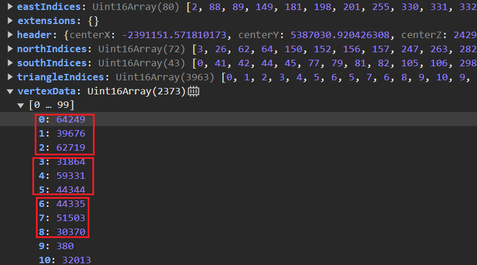

> 其中解读terrain后得到的vertexData数组如上，每3个值代表顶点的（u, v, h）


其中只有height的范围[`maxHeight`和`minHeight`]是已知的，则height值可直接通过32767进行插值

插值的计算公式为：
$$
height = minHeight + \frac{h}{32767} * (maxHeight - minHeight)
$$

$$
u = minu + \frac{u}{32767} * (maxu - minu)
$$

$$
v = minv + \frac{v}{32767} * (maxv - minv)
$$

=> 那么这个时候需求计算的到u和v的范围

根据计算可获得同一层级上的规律为：

> **在列号不变时**：中心点lat纬度不变，行变大lon经度变大，**ECEF下**：*centerX增大，centerY减小*
>
> **在行号不变时**：中心点lon经度不变，列变大lat纬度变大，**ECEF下**：*centerX和centerY都减小*

可以发现，若在ECEF下计算瓦片的范围，则无法通过改变的单变量去确定其瓦片的具体变化，不像在WGS84般直观，所以这里采用WGS84经纬度计算瓦片的范围。所以这时可以直接使用上述已经计算的**瓦片宽度（xsize）和高度（ysize）**进行计算瓦片的范围，之后再进行插值计算得到各顶点的经纬度，转为3857投影坐标。

#### 6）筛选框选范围内的顶点与计算顶点相对于整体中心的相对坐标（3857）

1. 通过最大矩形框的3857投影坐标范围去筛选瓦片中的顶点坐标；
2. 通过最大矩形框的4个顶点坐标解求整体的中心坐标；
3. 根据顶点的3857投影坐标与整体的中心坐标做差值得到顶点相对于整体中心的坐标。

### 7. 向后端传递框选范围 【Tif】

#### 1）左下角与右上角坐标的传递

在`TileCaculate.vue`中计算得到最大矩形框后，将其得到的**左下角与右上角**的点坐标数值传递到`vuex`中
`json = [minLon.value, minLat.value, maxLon.value, maxLat.value]`,然后在`TopDiv.vue`中监听**json**的变化，当其数值发生变化后，将其数组中的值赋予给data

```bash
  watch(jsonData, (newData, oldData) => {
      data = {
            "x1": newData[0],
            "y1": newData[1],
            "x2": newData[2],
            "y2": newData[3]
        }
   });
```

#### 2）通过axios库向后端发送post请求

`axios.post('/tinterrain/dem2tintiles', data, headerConfig)`

请求的URL为`/tinterrain/dem2tintiles`，请求体为`data`，请求头为`headerConfig`，当请求成功时（`response.data.code === 1`）通过`response`返回数据与状态信息，包括坐标的文件名，之后通过判断所返回的**文件名是否为空**，非空则构成坐标信息的txt下载链接 `downLoadUrl = 'http://localhost:80/tinterrain/download/' + coordinateFileName`，其中`coordinateFileName`为坐标文件名， 之后调用浏览器进行下载则可以得到框选区域的tif顶点信息。


## 实现难点

（1）探求稳定的连接方式与组件挂载方式及值传递展示
（2）解求terrain的准确性

## 部署方式

克隆本项目至本地，进入项目根目录`vue-test`

1. 安装项目依赖:

   ```bash
   npm install
   ```

2. 启动开发服务器：

   ```bash
   npm run dev
   ```

3. 启动上面所提供的 `http://localhost:端口号`进行页面访问(**目前已设置端口为5731，浏览器自动打开**)

- 请确保 Node.js 版本为 20 或以上。
- 推荐使用支持 Vue3 的现代浏览器以获取最佳体验。

## 使用方式

确保能正常运行本地的 MegaPublisher 客户端，查看项目设置中的 url 与端口号，可以自行将软件的url与端口号设置为  `localhost:4000` 和`2333`;

运行上面的 vue3 网页端，输入正确 url 与端口号，即可实现本地与 web 推流。

## 网页截图


## 更新日志

2024.1.8 新增技术文档

2024.1.15 新增画框与 terrain

2024.1.17 将页面控件封装为组件

2024.1.20 将图层管理封装为组件，并完善图层显示、隐藏、删除等操作，后续会加入增图层

2024.1.25 完成对框选区域的terrain瓦片解析，并将区域内的顶点筛选出来

2024.1.29 完成添加三维组件；摄像机飞行；bim模型3dtiles加载，查询构件并显示构件属性，删除构件（修改构件属性、鼠标点击构件查询待完成）

2024.2.28 完善解读terrain部分技术文档，与Bim部分文档整合

2024.3.10 完善Bim方面内容、图层信息更新模块

2024.3.11 完善terrain部分文档，包括与后端传值