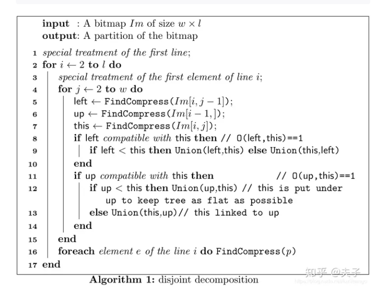

<!-- 前端、后端、C++算法三部分开发者各自编写此文档,文档中实现流程尽可能详细  -->

# 标题

## 简介

## 功能

## 技术栈

## 实现流程

## .terrain读取流程伪代码
 >[伪代码编写参考链接](https://zhuanlan.zhihu.com/p/105582648) https://zhuanlan.zhihu.com/p/105582648

## 实现难点

## 部署方式

## 使用方式

## 更新日志